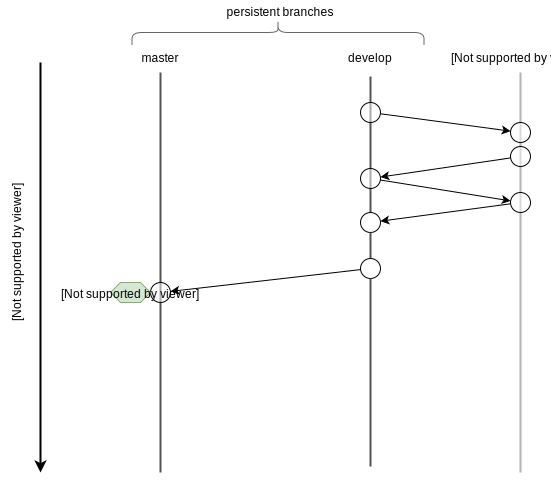

# Platform contracts

## Build Status

Branch|Build Status
---|---
Master|[](https://travis-ci.org/DaoCasino/platform-contracts.svg?branch=master)
Develop|[](https://travis-ci.org/DaoCasino/platform-contracts.svg?branch=develop)

## Description
This repo contain main DAOPlatform contracts.
Basically, that contracts are entry point and main registry in DAOPlatform ecosystem.
All system parts, including all games and casinos interact with this contracts.


Main components:
 - Main platform contract([link](./contracts/platform)) - represent main registry for all games and casinos
 - Game events contract([link](./contracts/events)) - helper contract that used for game events restration
 - Generic casino contract([link](./contracts/casino)) - casino contract that implement all casino related features like game listing, liqudity pool, benefit payment, etc.

## Build
```bash
git clone https://github.com/DaoCasino/platform-contracts
cd platform-contracts
./cicd/run build
```
## Run unit tests
```bash
./cicd/run test
```

# Contribution to platform contracts
Interested in contributing? That's awesome! Please follow our git flow:



*NOTE: make rebase to actual develop before PR*
